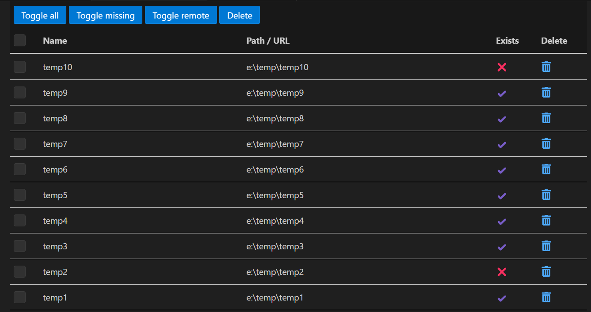

# Workspace Storage Cleanup (vscdb)

Easy manage your workspace storage inside `${globalStoragePath}/state.vscdb`

## Why

I used to open my Visual Studio Code workspaces with [PowerToys](https://github.com/microsoft/PowerToys), but I noticed that the list still showed the workspaces I had deleted. This bothered me, so I created this extension to clean up the workspace list.

## Screenshots

